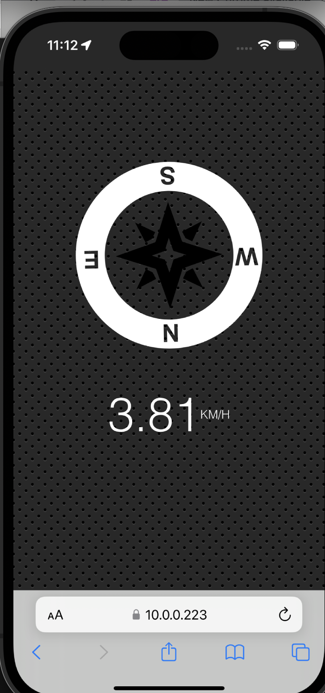

# Geolocation_based_Speedometer_and_Compass

This is a 30-days javascript grinding  
js30 [https://github.com/ningh98/js30]  
21. Geolocation_based_Speedometer_and_Compass [https://github.com/ningh98/Geolocation_based_Speedometer_and_Compass]

## Table of contents

- [Overview](#overview)
  - [Screenshot](#screenshot)
  - [How to use](#how-to-use)
- [My process](#my-process)
  - [Built with](#built-with)
  - [What I learned](#what-i-learned)

## Overview

This document represents a simple web page that visually displays speed and direction using geolocation data.

### Screenshot

### How to use

- Download all files
- npm install
- npm start
- open it in the browser and allow localhost to use location

## My process

### Built with

- HTML
- CSS
- Javascript

### What I learned

how to use js to work with iso simulator